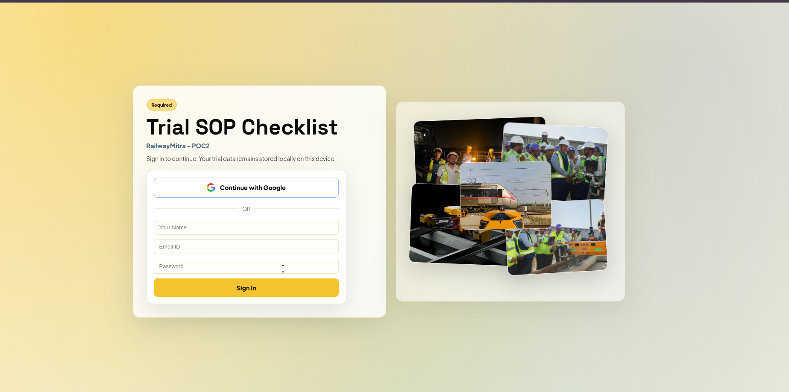
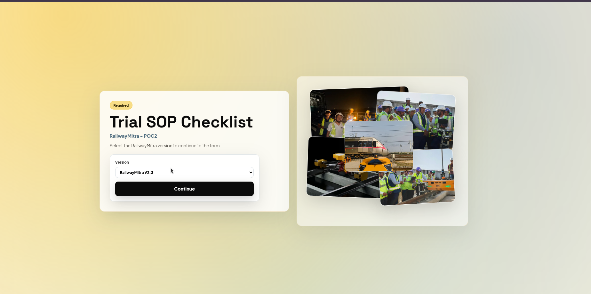
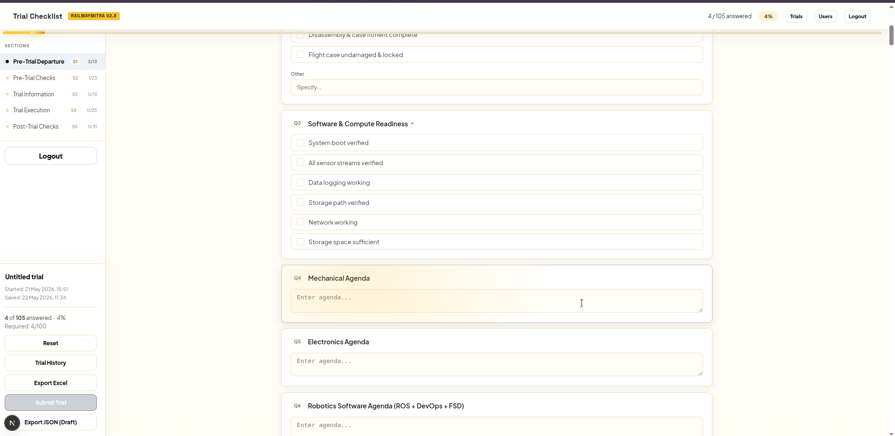
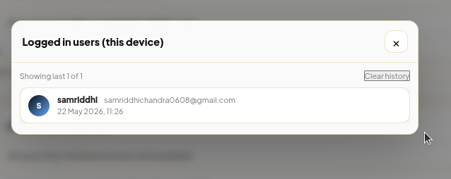
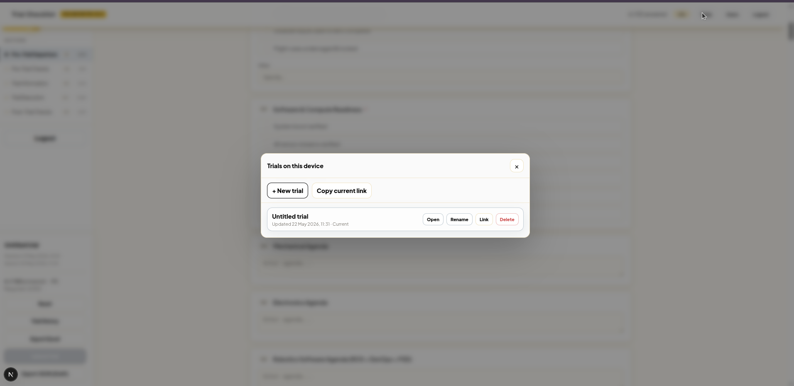
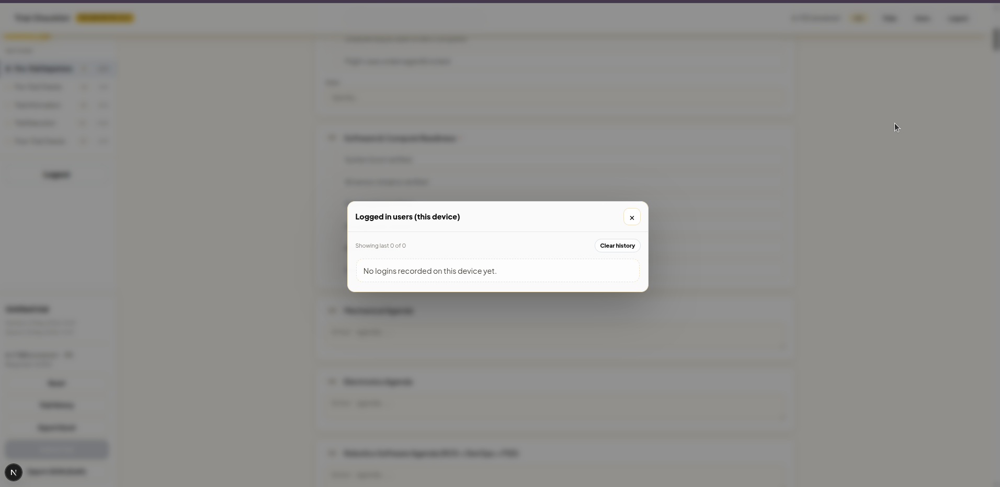
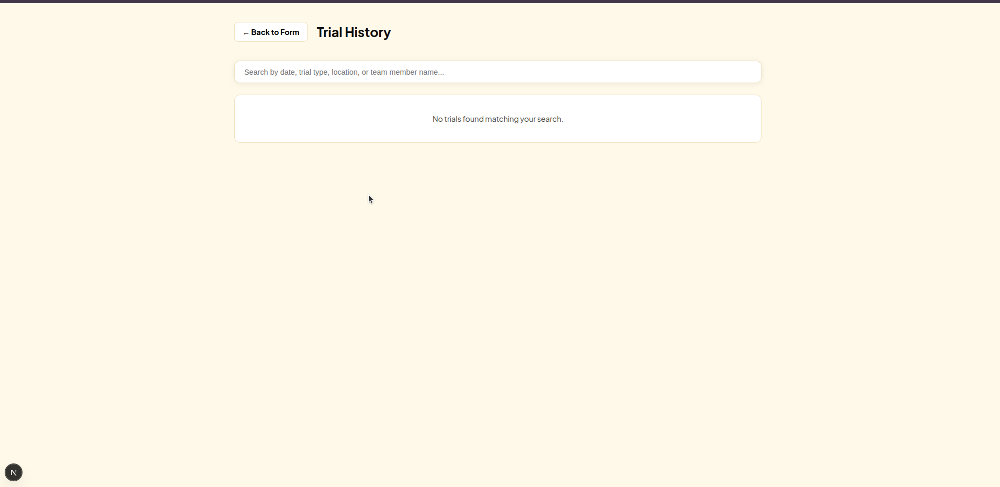

# Trial SOP Checklist

Sectioned Trial SOP checklist web app with **local-first autosave**, **multi-trial resume**, and **exports (JSON + CSV)**.

## Demo (Screenshots)

<table>
  <tr>
    <td></td>
    <td></td>
  </tr>
  <tr>
    <td></td>
    <td></td>
  </tr>
  <tr>
    <td></td>
    <td></td>
  </tr>
  <tr>
    <td colspan="2"></td>
  </tr>
</table>

## Why This App

Trial data entry is often **irregular**:
- Some sections are filled in the office.
- Later sections are filled on-track at different times.
- Connectivity can be weak or intermittent.

This app is built to **retain trial state safely** so the operator can continue later without losing progress.

## Key Features

- Sectioned checklist flow with **progress** and **required** indicators
- **Autosave** (local-first) so work isn’t lost if the tab is closed
- **Multiple trials** per device/browser (each trial has its own `trialId`)
- Resume via URL: `/form?trialId=...`
- **Exports**: JSON + Excel-friendly CSV
- **Login** via Firebase Auth (Google + email/password)
- “**Logged in users (this device)**” panel with timestamps
- Mobile-friendly UI (collapsible actions on small screens)

## Tech Stack

- Next.js (App Router)
- React
- Firebase Auth

## Getting Started

### Prerequisites

- Node.js 18+ (recommended)

### Install

```bash
npm ci
```

### Configure Firebase

Copy `.env.example` to `.env.local` and fill values:

- `NEXT_PUBLIC_FIREBASE_API_KEY`
- `NEXT_PUBLIC_FIREBASE_AUTH_DOMAIN`
- `NEXT_PUBLIC_FIREBASE_PROJECT_ID`
- `NEXT_PUBLIC_FIREBASE_APP_ID`

### Run (dev)

```bash
npm run dev
```

Open `http://localhost:3000`.

## Usage

### Start / Resume a Trial

Open the form at `/form`.

- Click **Trials** to create a new trial, open a saved trial, copy a resume link, or delete a trial (device-local).

### Reset / Export

- **Reset** clears the current trial’s answers (keeps the same `trialId`).
- **Export Excel** downloads a CSV.
- **Export JSON** downloads a JSON snapshot.

## Data Persistence Model

- Trial data is stored locally in the browser (LocalStorage).
- LocalStorage is **per device + per browser profile**.
- Clearing site data removes saved trials.

## Scripts

- `npm run dev` — start dev server
- `npm run build` — production build
- `npm start` — run production server
- `npm run lint` — run ESLint

## Project Structure

- `app/login/page.js` — login route
- `app/form/page.js` — checklist form route
- `app/history/page.js` — local trial history route
- `app/components/ChecklistApp.jsx` — checklist UI + autosave + exports + trial switcher
- `app/components/AuthProvider.jsx` — Firebase auth session wrapper
- `lib/checklistStorage.js` — trial persistence helpers
- `lib/loginHistory.js` — local login history helpers
- `public/demo1.png` … `public/demo7.png` — README screenshots

## Deployment

```bash
npm ci
npm run build
npm start
```

## License

Private / internal project (update if you intend to open source).
